Creating a Cooking Website with Express, Stylus and Jade
=============

#Objective

In this lab we will use Express to create [**Node recipes**](http://noderecipes.azurewebsites.net) a full fledged website which can scale to mobile browsers as well as to the desktop. By the end of this lab you will know

	1. How to write html templates with jade
	2. How to render a view with a jade template and a model using a route

Throughout the tutorial, you will come across the follow buzzwords.

* **Node.js**
* **Express.js**
* **Jade**
* **Stylus**
* **Route**
* **Server**
* **Client**
* **HTTP**

# Let's talk about the Internet

HTTP is a connectionless text based protocol. In a simplified view of the internet, you are either a **client** or a **server**. Clients (web browsers) send requests to web servers for web elements such as web pages and images. After the request is serviced by a server, the connection between client and server across the Internet is disconnected. A new connection must be made for each request.

When you type a URL into a web browser, this is what happens:

1. If the URL contains a domain name, the browser first connects to a domain name server and retrieves the corresponding IP address for the web server. Ex. If I type in google.com, your browser needs to figure out what the IP address is.
2. The web browser connects to the web server and sends an HTTP request for the desired web page. Ex. Once the browser knows the IP address, it sends the HTTP request to Google.
3. The web server receives the request and checks for the desired page. If the page exists, the web server sends it back to the client. If the server cannot find the requested page, it will send an HTTP 404 error message. (404 means 'Page Not Found' as anyone who has surfed the web probably knows.) Ex. Google returns a 404 if my request was garbage or it sends me the results of my search for cat pictures.
4. The web browser receives the page back and the connection is closed. Ex. Chrome receives the results.
5. The browser then parses through the page and looks for other page elements it needs to complete the web page. These usually include images, applets, etc. Chrome will load the results in the browser window.
6. For each element needed, the browser makes additional connections and HTTP requests to the server for each element.
When the browser has finished loading all images, applets, etc. the page will be completely loaded in the browser window. Ex. If Chrome needs to load images or stylesheets or other scripts, it will make subsequent requests to Google.

## What are we doing today?

Today we're going to build an application so that when we go to the browser and type in a url, **our application**, not some Google server sitting off in the desert, will return the data for our HTTP request. We're building our own server that will be designed to return the content that we care about. We're using recipe data to show meals for Barbeque, Dessert, and Brunch.

#Getting Started

##Using Nitrous.io

We'll be using [Nitrous](nitrous.io.), which is a cloud application platform that helps you create and configure the infrastructure and services for complex web applications in just seconds. This allows all of us to be working with the same version of software and same operating system to reduce any headaches.

###Steps###
####Create an account####
1. Go to https://www.nitrous.io/
2. Sign up for free
3. Confirm your email

####Create a box####
4. Open Dashboard
5. Create a new box
6. Choose the Node.js template
7. Name your box whatever you wish
8. Leave the other default settings
9. Click Create Box
10. Wait as it provisions and starts your new IDE

##Getting the code

```bash
git clone git@github.com:ssapra/jade-templating.git
```

In the console do:

```bash
cd jade-templating
cd EndProject
npm install
node app.js
```
Click the Preview tab and then Port 3000. This will open up a tab with the correct url for your app. This is what the finished product looks like and we'll spend this afternoon building on top of the basic code that I've already provided.

### What is Node.js?

The main idea of Node.js: use non-blocking, event-driven I/O to remain lightweight and efficient in the face of data-intensive real-time applications that run across distributed devices.

## What is NPM?

NPM is a package manager for Node.js. It allows you to install node modules which are a set of publicly available, reusable components, available through easy installation via an online repository, with version and dependency management

### What is Express?

Express.js is one of the most popular node modules. It is a Sinatra-inspired web development framework for Node.js, and the de-facto standard for the majority of Node.js applications out there today.

### Jade Files

Jade is a language used to create HTML templates on the server. This allows us to write HTML much easier because it avoid having to write as many brackets and also allows for us to **bind** a view to the underlying data model (similar to what Angular.js does in the browser).

### Stylus Files

Stylus is the Jade for CSS. It allows us to write CSS much easier than the raw CSS language.

### App.js

Navigate back to the StartProject folder. Exit from the server using Ctrl-c. Now, in the console

```bash
cd ~/jade-templating
cd StartProject
node app.js
```

On the left side bar, click the refresh button so you can see the tree of files and directories. Click on StartProject and click the app.js file so that we can see the code in that file.

You will notice that there is a considerable amount of stuff in your **app.js** file. Lets take a peek at the setup:

This code is loading the modules that we want for our application.
```js
var express = require('express');
var path = require('path');
var favicon = require('serve-favicon');
var logger = require('morgan');
var cookieParser = require('cookie-parser');
var bodyParser = require('body-parser');
```
This line is loading the routes that the application supports. If we peek in that file, we can see that only the '/' route is supported.
```js
var routes = require('./routes/index');
```

This line is loading the folder that holds all the views that will be **served** to the **client** (browser).
```js
	app.set('views', path.join(__dirname, 'views'));
```

We then tell Express that our view engine that we will be using is jade. Express can be used with a variety of view engines, but jade is the most popular choice:

```js
	app.set('view engine', 'jade');
```

This will set the favicon of the website to the default express.js image:
```js
	app.use(express.favicon());
```

Lastly, this line means that the server will be "listening" for your requests from the browser at the port 3000.
```js
app.set('port', process.env.PORT || 3000);
```

Run the application and you'll see the placeholder 'Express' title:

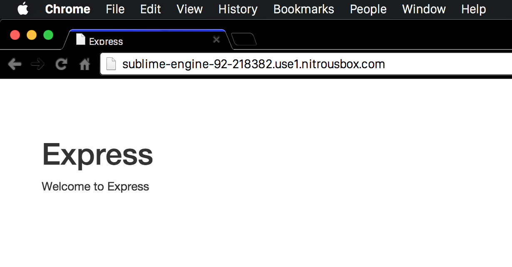

##Templating HTML with Jade

[Jade](http://jade-lang.com/reference/) is a simple light-weight html templating engine which makes it easier to write and reuse HTML.

The current solution has 2 jade view files:

**layout.jade**:

```js
//Layout.jade defines the layout of the entire website. It will contain the navbar and
//extension views will populate pageTitle and pageContent blocks
doctype html
html
  head
  title= title

  //indicate that our site is mobile optimized
  meta(name='viewport', content='width=device-width, initial-scale=1.0')

  //reference our site-specific css
  link(rel='stylesheet', href='/stylesheets/style.css')

  //add bootstrap dependencies from CDNjs. Using a CDN to distribute these files puts less pressure
  //on our web server and will be delivered faster to the client than our own server.
  script(src='//cdnjs.cloudflare.com/ajax/libs/jquery/2.1.1/jquery.min.js')
  script(src='//cdnjs.cloudflare.com/ajax/libs/twitter-bootstrap/3.2.0/js/bootstrap.min.js')
  link(rel='stylesheet', href='//cdnjs.cloudflare.com/ajax/libs/twitter-bootstrap/3.2.0/css/bootstrap-theme.min.css')
  link(rel='stylesheet', href='//cdnjs.cloudflare.com/ajax/libs/twitter-bootstrap/3.2.0/css/bootstrap.min.css')
  body
  block pageContent
```
You can see that the layout.jade sort-of looks like HTML, except there aren't any brackets. Instead jade uses **tabs**.

Notice how we have something called **block pageContent**. This tells jade that **layout.jade** will place any block named **pageContent** from an [*extension view*](http://www.devthought.com/code/use-jade-blocks-not-layouts/) in its place.

This same jade looks like this in when it is rendered HTML in the browser:


**Index.jade** is the default view of the page. It is an *extension view* of layout.jade (because of the **'extends** keyword). This means that it can place its content in the pageContent block inside layout.jade:

**index.jade**
```jade
extends layout

block pageContent
  h1= title
  p Welcome to #{title}
```
##Creating the Home Page

**Layout.jade** is pulling a references to [**Bootstrap**](http://getbootstrap.com/) which you used in BartNOW to create your responsive UI elements.


Each page on our website will contain a **pageTitle** and a **pageContent** block. Since we don't have a pageTitle block specified in Layout.jade, we'll add one above the pageContent block. Remember, jade uses tabs/whitespace to determine where html elements begin and end so **be careful with the indentation**:

**layout.jade**
```jade
body
  block pageTitle
  block pageContent
```

Now run the website again:


You'll notice that nothing happens. This is because index.jade, the default page doesn't define the block pageTitle. Take a look at index.jade. Notice that this is an *extension view* of **layout.** That means that what's in pageContent will be placed in the pageContent block in layout.jade.

**index.jade**
```jade
extends layout

block pageContent
  h1= title
  p Welcome to #{title}
```
We can add a new block with a bootstrap [**jumbotron**](http://getbootstrap.com/components/#jumbotron) UI element:
```jade
block pageTitle
  .jumbotron
    h1 Node recipes
    h2 Welcome! Here you will find a variety of scrumptious recipes for you to make
```
The block keyword doesn't map to anything in HTML and is only used by jade. This jade code translates to this HTML:
```html
	<div class="jumbotron">
		<h1>Node recipes</h1>
		<h2>Welcome! Here you will find a variety of scrumptious recipes for you to make</h2>
	</div>
```
Tabs in jade signify child elements in the HTML. You don't have to worry about closing any tabs. **.jumbotron** could be **div.jumbotron** but jade defaults to the **div** element type if you don't specify one. Jade lets you short hand **class='jumbotron'** by simply just using **.classname** instead.

Your entire index.jade should now be:
```jade
extends layout

block pageTitle
  .jumbotron
    h1 Node recipes
    h2 Welcome! Here you will find a variety of scruptious recipes for you to make

block pageContent
  h1= title
  p Welcome to #{title}
```
Run the Website and now we have a landing page message:

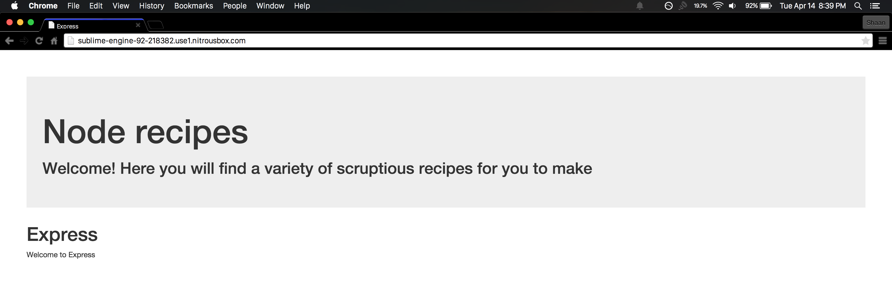

We don't want our site to have that pesky 'Express' tag on it so let's remove the pageContent block from our default view **index.jade**. It should now look like:

```jade
extends layout

block pageTitle
  .jumbotron
    h1 Node recipes
    h2 Welcome! Here you will find a variety of scruptious recipes for you to make
```
Now we should just have the jumbotron:

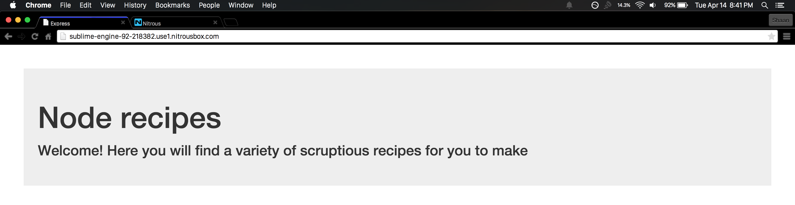

##Creating a Navigation Bar

Because **layout.jade** specifies how our web pages are laid out, it makes sense to put the bootstrap [**navbar**](http://getbootstrap.com/components/#navbar) here because every page should have a navigation bar:

The navbar will have 4 sections, **Home Page button**, **BBQ**, **Brunch**, **Dessert**. Each of these are the name of the kinds of recipes will eventually display on each page:

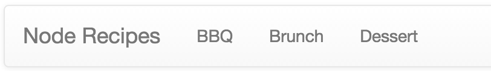

The HTML needed to create the navbar is:
```html
    <nav role="navigation" class="navbar navbar-default">
		<div class="container-fluid">
			<div class="navbar-header">
				<button data-toggle="collapse" data-target="#bs-example-navbar-collapse-1" class="navbar-toggle">
					<span class="sronly"></span>
					<span class="icon-bar"></span>
					<span class="icon-bar"></span>
					<span class="icon-bar"></span>
				</button>
				<a href="/#" class="navbar-brand">Node Recipes</a>
			</div>
			<div id="bs-example-navbar-collapse-1" class="collapse navbar-collapse">
				<ul class="nav navbar-nav">
					<li><a href="/recipes/bbq">BBQ</a></li>
					<li><a href="/recipes/brunch">Brunch</a></li>
					<li><a href="/recipes/dessert">Dessert</a></li>
				</ul>
			</div>
		</div>
	</nav>
```
The jade which produces this is (add this above **block pageTitle** in layout.jade):
```jade
    block navBar
        nav(class='navbar navbar-default', role='navigation')
            .container-fluid
                .navbar-header
                    button(class='navbar-toggle', data-toggle='collapse', data-target='#bs-example-navbar-collapse-1')
                        span.sronly
                        span.icon-bar
                        span.icon-bar
                        span.icon-bar
                    a(class='navbar-brand', href='/#') Node Recipes
                #bs-example-navbar-collapse-1(class='collapse navbar-collapse')
                    ul(class='nav navbar-nav')
                        li
                            a(href='/recipes/bbq') BBQ
                        li
                            a(href='/recipes/brunch') Brunch
                        li
                            a(href='/recipes/dessert') Dessert
```
As you can see it is *a lot* easier to write jade than it is raw HTML. Remember **block navBar** is just a jade specific marker which specifies the start of a new block. It doesn't render to any HTML.

Notice how each **li** element points to a [**route**](http://stackoverflow.com/questions/8864626/using-routes-in-express-js) on your server:

```jade
	ul(class='nav navbar-nav')
	    li
	        a(href='/recipes/bbq') BBQ
	    li
	        a(href='/recipes/brunch') Brunch
	    li
	        a(href='/recipes/dessert') Dessert
```
Now run your web site:

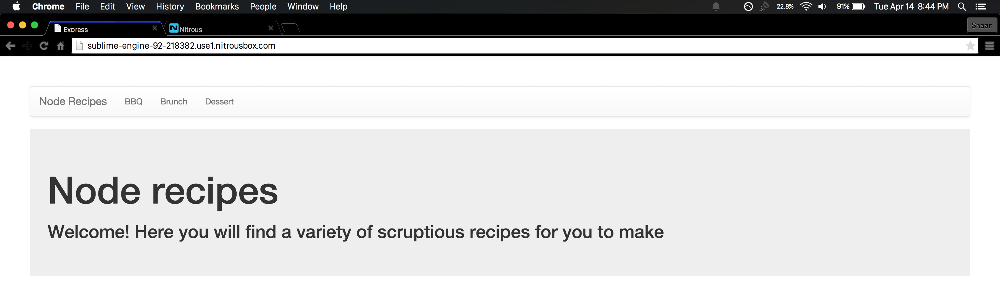


If you click on any of the items in the navbar you'll see that you get a page not found error:

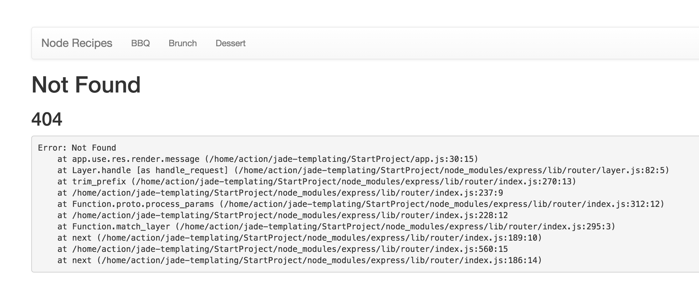

In the next section we will implement the views for each of the recipe kinds.

##Creating the Recipes Router


To create a new Recipe route add a new javascript file, **recipes.js** to the routes folder:

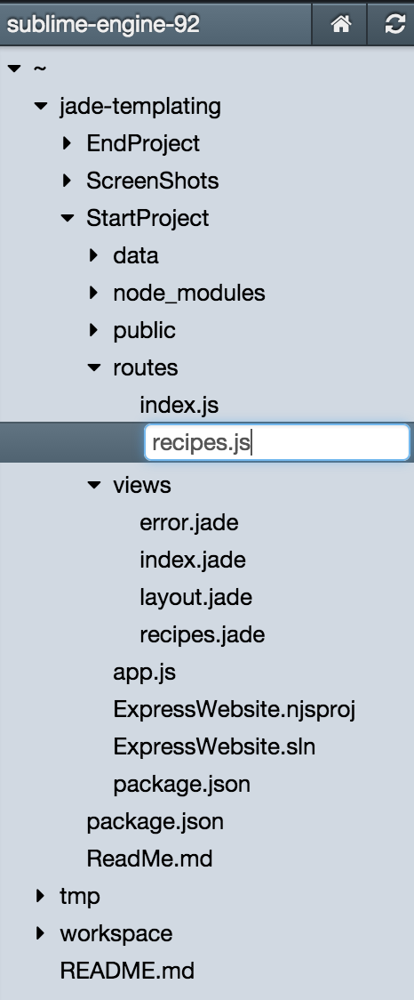

Create a new route handler

**recipes.js**
```js
var express = require('express');
var router = express.Router();

/* Renders Recipe view */
router.get('/:id', function(req, res) {

});

module.exports = router;
```
This route handler will handle all (HTTP GET) request from your browser. We will come back to how **'/:id'** defines our route.

Add a reference to **data.js**, our data source for recipes:

**recipes.js**
```js
var recipes = require('../data/recipeData.js');
var express = require('express');
var router = express.Router();

/* Renders Recipe view */
router.get('/:id', function(req, res) {

});

module.exports = router;
```
Now in **app.js** add a reference to **./routes/recipes**' router we just made:

**app.js**
```js
	var recipes = require('./routes/recipes.js');
```
Then add the router that will use the base route '/recipes' as  assign it to the recipes.list handler:

**app.js**
```js
	//default route
	app.use('/', routes);
	app.use('/recipes', recipes);
```
The last piece we need is to create a new view template **recipes.jade** file under the **views** folder:

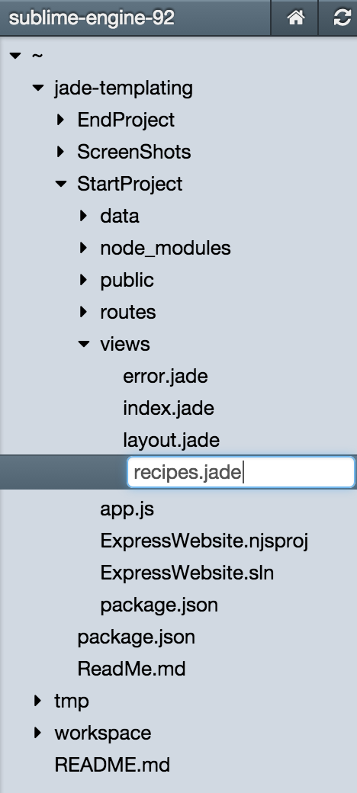

Let's go back and take a look at **data/recipeData.js**:
```js
	/**
    This is the data source for your application. In the real world, you would either get this data from a data base or
    from an API
	**/
	exports.recipeTypeName = {
	    bbq : 'Barbeque',
	    dessert : 'Dessert',
	    brunch : 'Brunch'
	}
	exports.bbq = [
	    {
	    name: 'Make-It-Mine Pork Kabobs',
	    ingredients: ["1 pound boneless pork loin or tenderloin",
	            "1 Onion",
	            "1 Zuchhini",
	            "1 Shitake Mushroom"
	        ],
	    photo : 'http://images.media-allrecipes.com/userphotos/250x250/01/07/80/1078019.jpg'
	},
	{
	    name: 'San Diego Grilled Chicken',
	    ingredients: ["1 pound boneless pork loin or tenderloin",
	            "1 Onion",
	            "1 Zuchhini",
	            "1 Shitake Mushroom"
	        ],
	    photo : 'http://images.media-allrecipes.com/userphotos/250x250/00/62/02/620268.jpg'
	},
	...
	]

	exports.brunch = [
	    {
	    name: 'Breakfast Scones',
	    ingredients: ["1 pound boneless pork loin or tenderloin",
	            "1 Onion",
	            "1 Zuchhini",
	            "1 Shitake Mushroom"
	        ],
	    photo : 'http://images.media-allrecipes.com/userphotos/250x250/00/01/71/17102.jpg'
	},
	{
	    name: 'Veggie-Bean Brunch Casserole',
	    ingredients: ["1 pound boneless pork loin or tenderloin",
	            "1 Onion",
	            "1 Zuchhini",
	            "1 Shitake Mushroom"
	        ],
	    photo : 'http://images.media-allrecipes.com/userphotos/250x250/00/88/68/886877.jpg'
	},
	...
	]

	exports.dessert = [
    {
	    name: 'Red, White and Blue Strawberry Shortcake',
	    ingredients: ["1 Cake",
	            "1 Red",
	            "1 Whit",
	            "1 Shitake Mushroom"
	        ],
	    photo : 'http://images.media-allrecipes.com/userphotos/250x250/00/97/60/976034.jpg'
	},
	{
	    name: 'All American Trifle',
	    ingredients: ["1 pound boneless pork loin or tenderloin",
	            "1 Onion",
	            "1 Zuchhini",
	            "1 Shitake Mushroom"
	        ],
	    photo : 'http://images.media-allrecipes.com/userphotos/250x250/01/17/91/1179163.jpg'
	},
	...
	]
```
In lieu of using a data source like a database or an API, we will use this file as our data source for recipes. **recipesData** contains 4 exported properties:


1. 	**recipesData.recipeTypeName** - A key/value pair that maps the recipe type name like 'BBQ' to Barbecue
2. 	**recipesData.bbq** - A collection of Barbecue recipes
3. 	**recipesData.brunch** - A collection of Brunch recipes
4. 	**recipesData.dessert** - A collection of Dessert recipes

Now that we have an idea of what our data looks like we can use express to render a recipe collection to the **recipe.jade** view. We will back the recipe view with the model:
```js
	{
		recipes: {
			list: <Collection of recipe objects from recipesData.js>,
			kind: <name of the recipe kind>
		}
	}
```
In the route handler **recipes.js** we will use the **res.render** function will allow us to render a view, with a model to the page:
```js
	var recipes = require('../data/recipesData.js');

	exports.list = function (req, res) {

	    var kind = req.params.id;

	    res.render('recipes', {
	        recipes: {
	            list: recipes[kind],
	            kind: recipes.recipeTypeName[kind]
	        }
	    });
	}
```
This will render the jade view **recipe** and back that the view with the data in **recipes** object.

Run the website and you'll notice when you click on any of the navbar items you get a blank page:

This is because the view template **recipes.jade** is blank.

#Creating the Recipes View Template

This is the easy part! We've already created our route, and attached our view to our data model. Now all we have to do is specify the jade template code so that the recipe shows up on our page.

The first thing we need to do is to declare that **recipes.jade** is an *extension view* of **layout.jade**:

**recipes.jade**
```jade
	extends layout
```
Now that we've done this, running the website again will show you that we get the navBar from layout.jade:

However the page is still blank. First we should add a **pageTitle** block. Layout.jade will place the html in that block first:
```jade
extends layout

block pageTitle
  //this will get displayed in the pageTitle block in layout.jade.
  //This makes a reference backing data model of this page
  h1 #{recipes.kind}
```
The **#{recipes.kind}** is a jade variable, and it will pull backing data model's **recipes.kind** value as the title of the page.

Run the website again and you will see the clicking on a tab will change the title of the page. This is because the underlying data for the template is changing even though the actual template, **recipes.jade** does not:

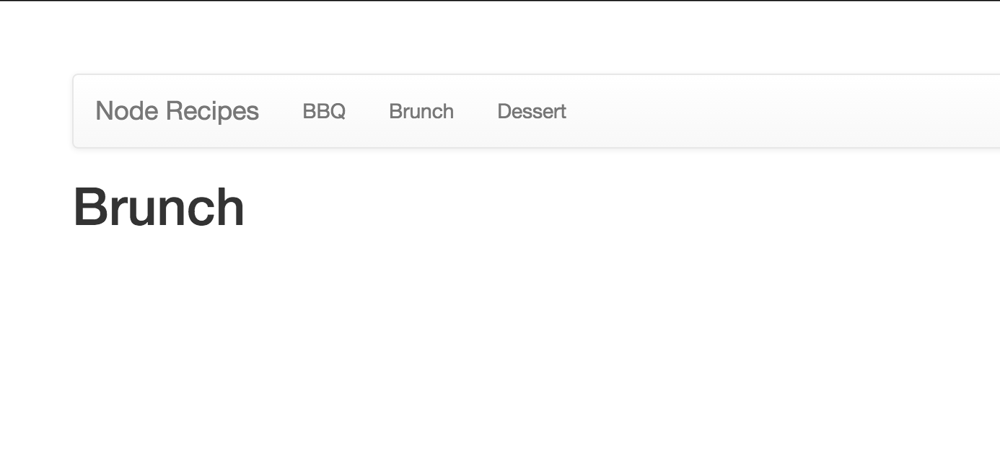

Now the most important part of course is where we will display the recipe data. First we need to specify a block **pageContent** which also comes from **layout.jade**. This block will be displayed after the **pageTitle** block.

```jade
extends layout
block pageContent

  ul
```
Now we will use another one of jade's important features. Jade allows us to create programmatic loops to repeat generating repetitive pieces of html. We can use these loops to iterate though the **recipes.list** recipe collection in the backing data model.

```jade
extends layout
block pageContent

  ul
  each recipe in recipes.list
    h2 #{recipe.name}
```
Run your website and see how it looks:

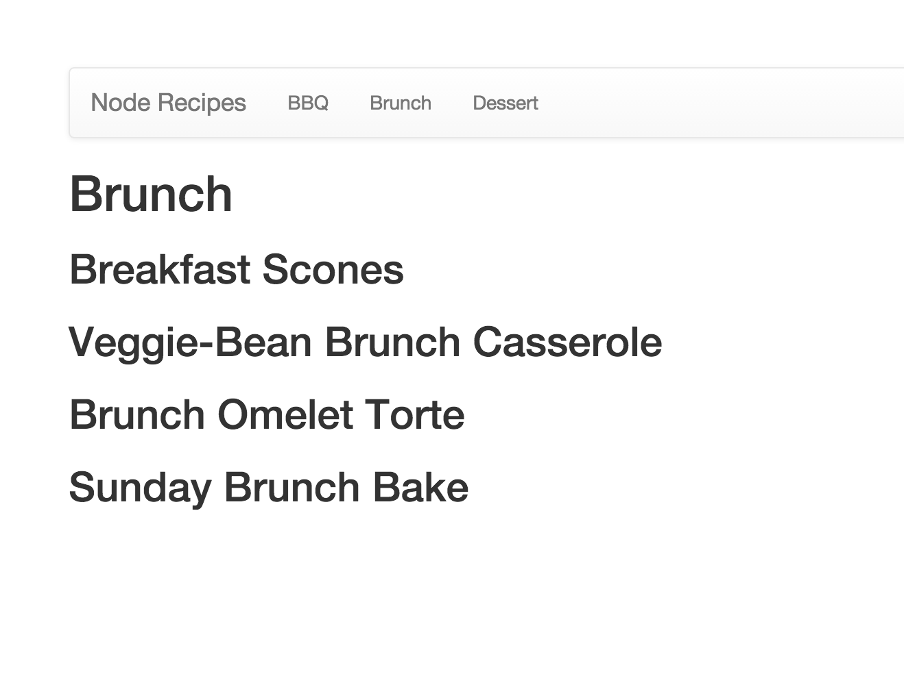

The **each** jade statement will actually iterate through a collection in the underlying data model. In this case, jade is going to print out with an h2 header the **name** field on every item in the **recipes.list** collection.

We can do a bit better on the UI layout by using the bootstrap [**well**](http://getbootstrap.com/components/#wells)  UI widget.

```jade
extends layout
block pageContent

  ul
  each recipe in recipes.list
  	//create a new well for each recipe model
    .well
      h2 #{recipe.name}
      img(src='#{recipe.photo}')
```

Reload your webpage and you'll see that a well is created to contain the recipe. We also added the photo using another jade variable **#{recipe.photo}** and which pulls the photo from the recipe data model. This is then placed as the **src** attribute to an **img** html element:

Now let's add the ingredients:

```jade
extends layout
block pageContent

  ul
  each recipe in recipes.list
    //create a new well for each recipe model
    .well
      h2 #{recipe.name}
      img(src='#{recipe.photo}')
      h3 Ingredients
      h5
      ul
      each ingredient in recipe.ingredients
        li=ingredient
```
Within the main **each** loop which iterates through reach recipe, we create new **li** elements within a **ul** element by iterating through the recipe.ingredients collection for each recipe.

Reload the page again and you'll see that you get the ingredients listed!

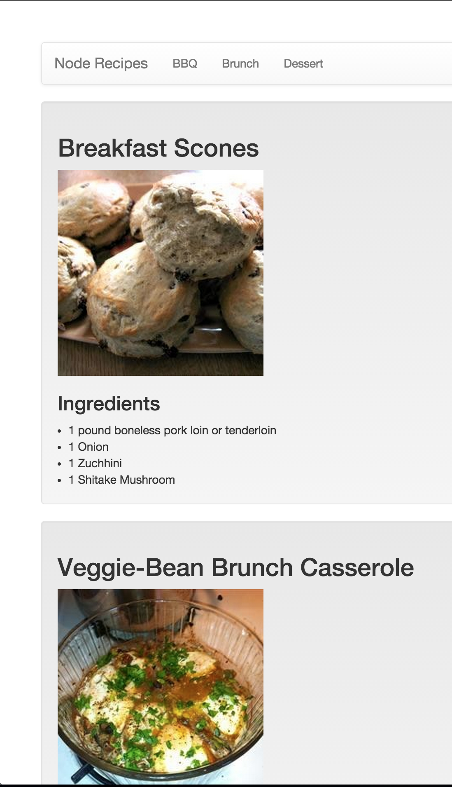

Switching between tabs changes the underlying data model and reloads the same template:

One more thing to note, this page is already **mobile optimized** thanks to bootstrap. This code in your layout.jade does this trick:

**layout.jade**

```jade
	//indicate that our site is mobile optimized
    meta(name='viewport', content='width=device-width, initial-scale=1.0')
```
This tells mobile browsers that your website is optimized for mobile. You can test how your site reacts to a smaller window by just re-sizing it:

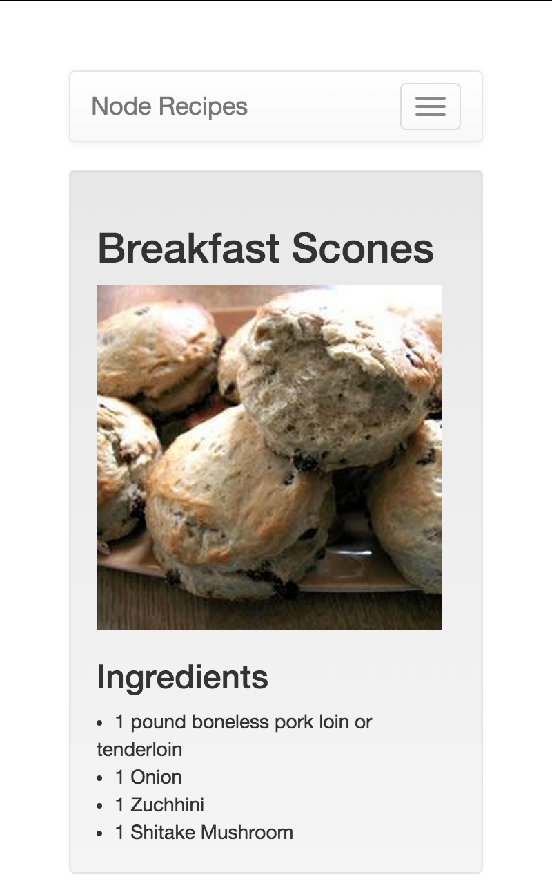


That's it! Congratulations you've created your first Node.js website!
